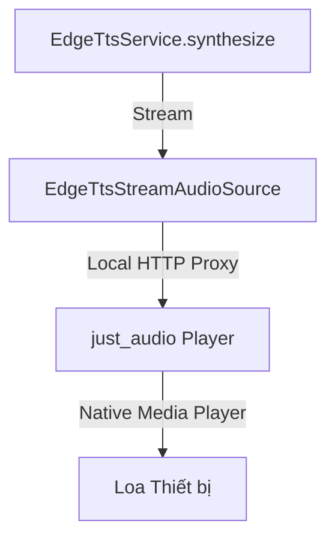
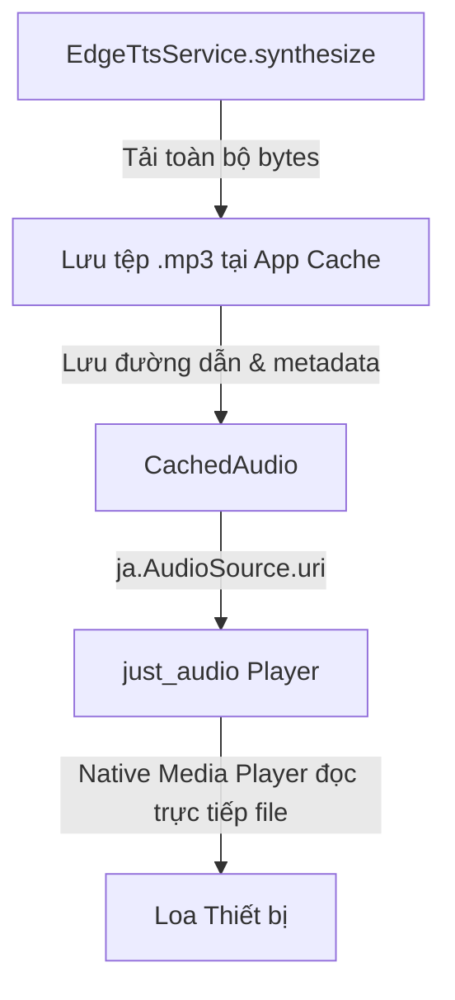

# Thiết kế kỹ thuật sửa lỗi Edge TTS

Tài liệu này mô tả thiết kế kiến trúc và giải pháp kỹ thuật để khắc phục lỗi phát Edge TTS trên iOS và Android.

## Kiến trúc cũ vs Kiến trúc mới

### Kiến trúc cũ (Truyền phát trực tiếp - Streaming)

* **Vấn đề:** 
  - Trên Android: Hệ thống chặn kết nối HTTP không mã hóa tới Local HTTP Proxy của `just_audio` (Lỗi Cleartext Traffic).
  - Trên iOS: Local HTTP Proxy dễ bị ngắt kết nối khi ứng dụng chạy nền hoặc khi hệ thống dọn dẹp tài nguyên socket mạng.

### Kiến trúc mới (Lưu tệp cục bộ - Local File)

* **Ưu điểm:**
  - Không thông qua Local HTTP Proxy hay socket mạng nội bộ nào khi phát âm thanh. Trình phát native của hệ điều hành đọc trực tiếp tệp tin trên đĩa.
  - Vượt qua 100% chính sách Cleartext Traffic trên Android và bảo đảm phát chạy nền ổn định trên iOS.

---

## Chi tiết Thiết kế các thành phần

### 1. Dọn dẹp dữ liệu và cấu trúc lớp
- Xóa bỏ lớp `EdgeTtsStreamAudioSource` trong [audio_handler.dart](file:///d:/Personal_Sources/NovelReader/lib/services/audio_handler.dart).
- Sửa đổi lớp `CachedAudio`:
  ```dart
  class CachedAudio {
    final String? filePath;
    final List<EdgeMetadataChunk> metadata;
    CachedAudio({this.filePath, required this.metadata});
  }
  ```

### 2. Đồng bộ luồng prefetch và ghi tệp cục bộ
Trong hàm `prefetchSingle()` của [audio_handler.dart](file:///d:/Personal_Sources/NovelReader/lib/services/audio_handler.dart):
- Không phân biệt hệ điều hành khi tải Edge TTS. Sử dụng chung đoạn code tải toàn bộ bytes của luồng:
  ```dart
  final audioBytes = <int>[];
  final metadata = <EdgeMetadataChunk>[];
  final stream = EdgeTtsService.synthesize(text: text, voice: voice);
  
  subscription = stream.listen(
    (chunk) {
      if (chunk is EdgeAudioChunk) {
        audioBytes.addAll(chunk.data);
      } else if (chunk is EdgeMetadataChunk) {
        metadata.add(chunk);
      }
    },
    onError: (err) {
      _pendingPrefetches.remove(cacheKey);
      _activePrefetches.remove(cacheKey);
      if (!completer.isCompleted) completer.completeError(err);
    },
    onDone: () async {
      _activePrefetches.remove(cacheKey);
      try {
        if (audioBytes.isEmpty) throw Exception("Empty audio bytes");
        final tempDir = await PathHelper.getAppCacheDirectory();
        final file = File('${tempDir.path}/tts_$cacheKey.mp3');
        await file.writeAsBytes(audioBytes, flush: true);
        
        final cached = CachedAudio(filePath: file.path, metadata: metadata);
        _addToCache(cacheKey, cached);
        _pendingPrefetches.remove(cacheKey);
        if (!completer.isCompleted) completer.complete(cached);
      } catch (e) {
        _pendingPrefetches.remove(cacheKey);
        if (!completer.isCompleted) completer.completeError(e);
      }
    },
    cancelOnError: true,
  );
  _activePrefetches[cacheKey] = subscription;
  ```
- **Hủy kết nối chuẩn xác:** Khi người dùng đổi đoạn, dừng nhạc hoặc chuyển bài, hàm `cancelAllPrefetches()` và `cancelOtherPrefetches()` sẽ duyệt qua `_activePrefetches` để gọi `.cancel()` trên `subscription`. Việc này đóng WebSocket lập tức, không để luồng tải ngầm hoạt động.

### 3. Cải tiến hàm phát âm thanh `speak()`
Trong hàm `speak()` của [audio_handler.dart](file:///d:/Personal_Sources/NovelReader/lib/services/audio_handler.dart):
- Loại bỏ toàn bộ logic sử dụng `EdgeTtsStreamAudioSource`.
- Nếu chưa có dữ liệu trong cache, gọi và đợi `prefetchSingle()` hoàn tất để lấy tệp tin:
  ```dart
  if (cached == null) {
    cached = await prefetchSingle(text, voice, rate, provider);
  }
  ```
- Cập nhật ranh giới chữ highlight: `_edgeMetadata.addAll(cached.metadata)`.
- Thiết lập tệp tin cho trình phát:
  ```dart
  await _edgePlayer.setAudioSource(ja.AudioSource.uri(Uri.file(cached.filePath!)));
  _edgePlayer.play();
  ```

### 4. Quản lý dọn dẹp bộ nhớ đệm
- Cơ chế `_cleanOldCacheFiles()` hiện tại đã tự động dọn dẹp các tệp tin có tên bắt đầu bằng `tts_` trong thư mục cache sau 1 ngày, nên không cần sửa đổi thêm phần dọn dẹp.
